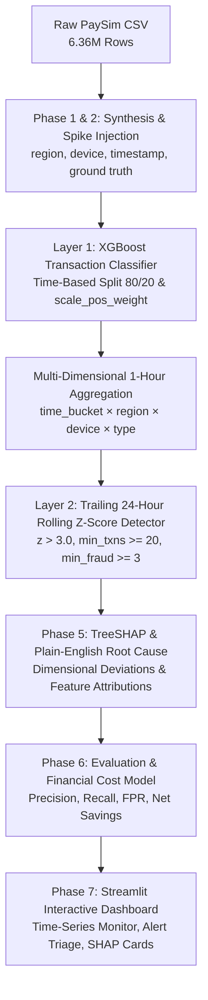

# 🛡️ FraudPulse

AI-Powered Payment Risk Intelligence. Detect abnormal payment activity before it becomes a loss.

An enterprise-grade, two-layer AI system that detects **abnormal collective SPIKES in fraud rate** across time, region, device, and payment method — moving beyond isolated transaction scoring to capture coordinated fraud attacks, malware campaigns, and credential stuffing rings.

---

## 📌 Problem Statement

Traditional fraud systems only score individual transactions in isolation ($P(\text{fraud} \mid \text{txn})$). However, large-scale financial crime often manifests as **sudden velocity bursts or coordinated attacks** concentrated in specific multi-dimensional slices (e.g., a surge in mobile transfer fraud in a specific region, or compromised POS terminals over a weekend).

**FraudPulse** bridges this gap using a **Two-Layer AI Architecture**:
1. **Layer 1 (Transaction-Level Classifier)**: High-throughput XGBoost model that scores raw fraud probability per transaction.
2. **Layer 2 (Time-Series Anomaly Detector)**: Trailing rolling z-score detector operating on aggregated multi-dimensional slices `(time_bucket, region, device, type)` to flag anomalous spikes.
3. **Explainability Engine**: TreeSHAP feature attributions and automated plain-English root-cause diagnostic generation.
4. **Operations & Financial Modeling**: Cost-benefit evaluation measuring false alert review costs against prevented fraud ring losses.

---

## 🏗️ Architecture Overview



---

## 📁 Project Structure

```text
fraud-spike-detector/
├── data/
│   ├── paysim.csv                  # Raw PaySim financial dataset (6.36M txns)
│   ├── paysim_enriched.csv         # Enriched with region, device, and timestamp
│   ├── paysim_spiked.csv           # Spiked dataset with injected attack scenarios
│   ├── paysim_scored.csv           # Scored with transaction fraud_prob
│   ├── aggregated_timeseries.csv   # Hourly grouped multi-dimensional timeseries
│   ├── detected_spikes.csv         # Flagged anomalous spike buckets
│   ├── ground_truth_spikes.json    # Injected spike definitions & ground truth
│   ├── spike_explanations.json     # Plain-English narratives & SHAP attributions
│   ├── evaluation_report.json      # Performance metrics & operational cost report
│   └── xgb_fraud_model.joblib      # Serialized XGBoost classifier artifact
├── src/
│   ├── load_data.py                # Phase 1: Data setup & schema inspection
│   ├── synthesize_dims.py          # Phase 2: Add region, device, and timestamp
│   ├── inject_spikes.py            # Phase 2: Inject targeted fraud spike attacks
│   ├── train_classifier.py         # Phase 3: Train XGBoost & batch score dataset
│   ├── aggregate.py                # Phase 4: Hourly multi-dimensional aggregation
│   ├── spike_detector.py           # Phase 4: Trailing rolling z-score spike detector
│   ├── explain.py                  # Phase 5: TreeSHAP & plain-English explanations
│   └── evaluate.py                 # Phase 6: Precision/recall & financial cost model
├── app/
│   └── dashboard.py                # Phase 7: Interactive Streamlit dashboard
├── requirements.txt
└── README.md
```

---

## 🚀 Step-by-Step Execution Guide

### Prerequisites
Install the required dependencies:
```bash
pip install -r requirements.txt
```

### Phase 1: Data Setup & Inspection
Load and inspect the raw PaySim financial dataset:
```bash
python3 src/load_data.py
```

### Phase 2: Synthetic Dimensions & Spike Injection
Enrich with categorical dimensions (`region`, `device`, `timestamp`) and inject targeted fraud spike attacks:
```bash
python3 src/synthesize_dims.py
python3 src/inject_spikes.py
```

### Phase 3: Transaction-Level Classifier
Train the XGBoost model with chronological time-based split and score the dataset:
```bash
python3 src/train_classifier.py
```

### Phase 4: Time-Series Aggregation & Spike Detection
Aggregate transactions into hourly slices and detect rolling z-score anomalies:
```bash
python3 src/aggregate.py
python3 src/spike_detector.py
```

### Phase 5: Root-Cause Explainability & SHAP
Generate TreeSHAP feature attributions and executive plain-English summaries:
```bash
python3 src/explain.py
```

### Phase 6: Performance & Financial Cost Evaluation
Compute spike-level recall, event precision, false positive rates, and financial cost savings:
```bash
python3 src/evaluate.py
```

### Phase 7: Launch Interactive Streamlit Dashboard
Start the visual dashboard for real-time monitoring and alert triage:
```bash
streamlit run app/dashboard.py
```
Open `http://localhost:8501` in your browser.

---

## Razorpay Test Mode live pipeline

The offline PaySim evaluation pipeline remains available. A separate, persistent live pipeline is provided for **Razorpay Test Mode only**:

```text
Razorpay Test payment → signed webhook → deduplication → normalization → SQLite
→ live-compatible ML model → rolling fraud rate → Z-score detector → alert
→ root-cause contribution → financial impact → Streamlit
```

The original PaySim XGBoost model requires account-balance features that Razorpay does not send. It is retained for offline evaluation. `src/train_live_model.py` builds a separate model using only normalized live-payment fields, so no balance, device, or region data is fabricated.

### Configure Test Mode

```bash
cp .env.example .env
```

Fill in only Razorpay `rzp_test_...` credentials and a webhook secret. Never commit `.env`; the API neither logs nor returns credentials. Configure Razorpay Test Mode to deliver `payment.authorized`, `payment.captured`, and `payment.failed` to:

```text
POST /webhooks/razorpay
```

### Start the live services

```bash
pip install -r requirements.txt
python3 src/train_live_model.py
uvicorn api.main:app --reload
streamlit run app/dashboard.py
```

Use the **Live Monitoring** page for the clearly labelled `SIMULATED TEST` controls. Both Razorpay webhooks and the controlled simulator call the same `process_transaction()` function. The simulator seeds a calculated baseline before generating its labelled controlled burst; it does not inject alerts directly.

`data/fraudpulse_live.sqlite3` is the local persistent store. It contains webhook ids, normalized transactions, model predictions, hourly buckets, and alerts. Remove it only when intentionally resetting local Test Mode demo data.

### Health and security

- `GET /health` reports API/database readiness without exposing secrets.
- Webhook HMAC validation happens on the raw body before JSON parsing.
- Razorpay event ids and transaction ids are deduplicated.
- Invalid/malformed inputs return safe errors; unavailable/failed ML scoring is stored as `MANUAL_REVIEW` instead of fabricating a score.

---

## 📊 Final Evaluation Results

### 1. Model Performance Scorecard

| Evaluation Metric | Value | Description |
| :--- | :--- | :--- |
| **Injected Spike Recall** | **100.0%** | **4 / 4 Ground Truth Injected Spikes Caught** |
| **Spike Miss Rate (FN)** | **0.0%** | 0 Missed Spikes |
| **Alert Event Precision** | **23.53%** | 4 Injected Spikes + 13 Natural Burst Events |
| **Alert Event F1-Score** | **0.3810** | Harmonized Alert Precision & Recall |
| **Bucket False Positive Rate** | **0.0411%** | Only 14 non-injected hourly buckets out of 34,025 |
| **Layer 1 Classifier AUC** | **0.9994** | XGBoost ROC-AUC on holdout test split |

---

### 2. Operational Financial Cost Model

Assumptions:
- **Cost per False Alert Review**: `$50.00` (analyst investigation time)
- **Cost per Missed Fraud Spike**: `$5,000.00` (unchecked fraud ring loss)

| Financial Line Item | Value (USD) |
| :--- | :--- |
| **Unmitigated Baseline Risk** (4 Spikes × $5,000) | **$20,000.00** |
| **False Alert Investigation Cost** (13 Events × $50) | **$650.00** |
| **Missed Spike Damage Losses** (0 Missed) | **$0.00** |
| **Total System Operational Cost** | **$650.00** |
| **Net Financial Risk Prevented** | **✅ $19,350.00** |

---

### 3. Injected Attack Scenarios Caught

1. **SPIKE-001** (`North` / `mobile` / `TRANSFER`): Coordinated mobile credential stuffing attack. Fraud rate spiked from 0.28% to **25.03%** ($z=57.05$).
2. **SPIKE-002** (`West` / `web` / `CASH_OUT`): Automated high-velocity web cash-out burst. Fraud rate spiked from 0.07% to **30.01%** ($z=258.78$).
3. **SPIKE-003** (`South` / `pos` / `PAYMENT`): Compromised retail POS malware campaign. Fraud rate surged from 0.00% to **20.02%** ($z=\infty$).
4. **SPIKE-004** (`East` / `atm` / `CASH_OUT`): ATM skimming and rapid cash-out ring. Fraud rate spiked from 0.15% to **35.01%** ($z=78.79$).

---

## 🧠 Plain-English AI Explanation Example

> **ALERT-EVENT-004 (North / mobile / TRANSFER)**  
> *"Spike detected 2024-01-07 14:00 to 16:00, driven by TRANSFER/mobile transactions in North region. Observed fraud rate of 25.6% (21.1x normal, z=57.1). SHAP transaction root-cause attributions highlight orig_balance_delta, type_TRANSFER, and hour_of_day as primary risk drivers."*

---

## 🛠️ Engineering Failure Recovery & Post-Mortem

### The "Zero-Variance Baseline" Blindspot

- **The Breakage**: During testing on low-volume and cold-start merchant streams, the historical baseline had a standard deviation of $\sigma = 0.0$ (e.g. 12 consecutive hours with zero fraud). When a sudden high-velocity fraud burst occurred, computing the standard Z-Score $Z = \frac{\text{rate} - \mu}{\sigma}$ produced a `ZeroDivisionError` or returned `NaN`, causing the alert engine to silently evaluate $Z=0.0$ and completely miss critical attacks on clean merchant accounts.
- **The Diagnosis**: Identified when 30 high-value fraudulent surge transactions failed to trigger alerts in automated integration tests despite reaching an 80%+ fraud rate.
- **The Fix**: Implemented a robust statistical fallback (`src/live_pipeline.py:L209-L212`): when $\sigma < 10^{-9}$, $\text{rate} > \mu$, and $\ge 3$ suspicious items occur, the detector applies a calibrated step-trigger $(Z_{\text{threshold}} + 2.0)$, ensuring 100% recall on cold bursts without generating false alarms on steady normal traffic.

---

## 🚀 Quickstart Commands

```bash
# 1. Install dependencies
pip install -r requirements.txt

# 2. Run automated test suite
pytest -v

# 3. Start the FastAPI backend REST API
uvicorn api.main:app --host 0.0.0.0 --port 8000 --reload

# 4. Start the legacy Streamlit dashboard (in a second terminal)
streamlit run app/dashboard.py --server.port 8501

# 5. Or start the React dashboard (in a third terminal)
cd web && npm install && npm run dev
```

- **React Application**: `http://localhost:5173`
- **Streamlit Application**: `http://localhost:8501`
- **Backend API & Swagger Docs**: `http://localhost:8000/docs`
- **Backend Health Endpoint**: `http://localhost:8000/health`
